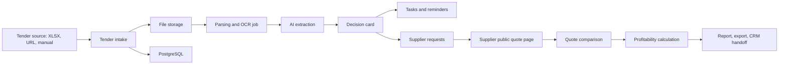

# Architecture

## Architecture Style

Use a modular monolith first. The product has many moving parts, but splitting into microservices too early would slow development and make local testing harder.

## Components

### Web App

Path: `apps/web`

- Next.js with App Router.
- TypeScript.
- React Query or server actions for data fetching.
- Tailwind CSS and shadcn-style primitives.
- Auth screens, tender dashboard, tender card, supplier quote form, task board.

### API

Path: `apps/api`

- FastAPI.
- Pydantic schemas.
- SQLAlchemy 2 or SQLModel.
- Alembic migrations.
- JWT/session auth.
- REST API first; event streaming can be added later for job progress.

### Database

- PostgreSQL.
- pgvector for embeddings over tender document chunks, supplier categories, and historical tenders.

### Background Jobs

- Redis.
- Celery or RQ.
- Jobs: file parsing, OCR, AI extraction, email sending, reminders, supplier matching, report generation.

### File Storage

- S3-compatible storage.
- Local development: MinIO.
- Store original documents, extracted text, generated reports, uploaded supplier files.

### AI Layer

The API should not call a model directly from business code. Use an internal AI service module with provider abstraction.

AI use cases:

- Structured extraction from tender documents.
- Risk classification.
- Position extraction and normalization.
- Supplier request generation.
- Quote normalization.
- Tender Q&A over uploaded documents.

### Integrations

MVP:

- Telegram bot for task alerts.
- SMTP/email for supplier requests.
- XLSX import/export.

Later:

- Bitrix24.
- AmoCRM.
- 1C file exchange.
- zakupki.gov.ru / commercial tender data providers.

## Data Flow

## Local Development

Use Docker Compose for:

- Postgres.
- Redis.
- MinIO.
- API.
- Web.

Keep AI keys in `.env.local` / `.env`, never committed.
