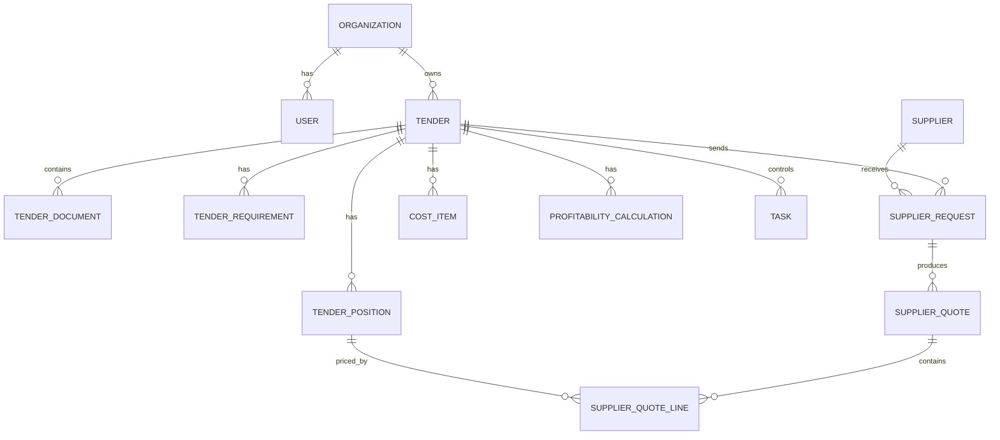

# Data Model

## Main Entities

### Organization

Customer company using ASTS.

Fields:

- id
- name
- inn
- subscription_plan
- created_at

### User

System user.

Fields:

- id
- organization_id
- name
- email
- phone
- role
- telegram_chat_id
- is_active

### Tender

Tender opportunity.

Fields:

- id
- organization_id
- external_id
- source_system
- source_url
- title
- customer_name
- customer_inn
- initial_price
- currency
- region
- delivery_place
- tender_type
- platform
- publication_date
- submission_deadline
- status
- responsible_user_id
- ai_score
- ai_recommendation
- ai_summary
- created_at
- updated_at

### TenderDocument

Uploaded or downloaded document.

Fields:

- id
- tender_id
- file_name
- file_type
- storage_key
- extracted_text_storage_key
- parse_status
- created_at

### TenderRequirement

Extracted requirement or risk.

Fields:

- id
- tender_id
- type
- title
- description
- severity
- source_document_id
- source_page
- confidence

### TenderPosition

Product, work, or service line.

Fields:

- id
- tender_id
- name
- description
- quantity
- unit
- okpd2_code
- okpd2_confidence
- required_specs
- source_document_id
- confidence

### Supplier

Supplier directory.

Fields:

- id
- organization_id
- name
- inn
- email
- phone
- website
- okved_codes
- okpd2_categories
- reliability_score
- source
- created_at

### SupplierRequest

Request for quote sent to one supplier.

Fields:

- id
- tender_id
- supplier_id
- public_token
- status
- sent_at
- opened_at
- submitted_at

### SupplierQuote

Supplier commercial offer.

Fields:

- id
- supplier_request_id
- tender_id
- supplier_id
- total_amount
- vat_rate
- delivery_days
- validity_until
- uploaded_file_key
- comment
- created_at

### SupplierQuoteLine

Quote line per tender position.

Fields:

- id
- supplier_quote_id
- tender_position_id
- offered_name
- offered_specs
- unit_price
- quantity
- vat_rate
- is_analog
- analog_comment

### CostItem

Additional cost for margin calculation.

Fields:

- id
- tender_id
- type
- title
- amount
- responsible_user_id
- status

### ProfitabilityCalculation

Tender economics snapshot.

Fields:

- id
- tender_id
- revenue
- purchase_cost
- logistics_cost
- platform_cost
- other_cost
- gross_profit
- margin_percent
- scenario_name
- created_at

### Task

Operational task.

Fields:

- id
- tender_id
- assignee_id
- role
- title
- description
- status
- due_at
- escalation_user_id
- reminder_count
- created_at
- completed_at

## ER Sketch

