# Реестр восстановления B2G mind map

Источник: `/Users/stanataev/Downloads/Copy_of_B2G.pdf`.

Дата фиксации: 2026-06-11.

Цель документа: не потерять проверенную логику старой B2G/АСТС-системы при переходе к новой AI-версии.

Этот документ является контрольной картой. Код, модели данных, API и интерфейсы должны сверяться с ним перед merge.

## Как объединяем работу, чтобы ничего не потерять

### Порядок merge

1. Сначала вливаем PR с восстановленной логикой и roadmap: `codex/b2g-rtb-analysis` -> `main`.
2. После этого каждый технический PR проверяем не только на работоспособность, но и на соответствие этому реестру.
3. Если PR добавляет модель, статус, роль, расчет, задачу или интеграцию, он должен ссылаться на конкретный блок этого документа.
4. Если старая логика не нужна в MVP, мы не удаляем ее из модели, а помечаем как `later`.
5. Если нашли новый фрагмент в PDF, сначала обновляем этот реестр, потом код.

### Merge-gate для каждого PR

Перед объединением проверяем:

- PR не пушит напрямую в `main`;
- изменение связано с issue или этапом roadmap;
- не теряется ни один статус основной воронки;
- новые enum/status/reason не противоречат старой карте;
- ручные сценарии старой системы либо заменены AI-модулем, либо сохранены как human review;
- документы и raw-данные не перезаписываются без версии;
- источники данных соответствуют политике первоисточников;
- если меняется расчет рентабельности, указаны формулы и настройки организации;
- если меняется поставщик/КП, сохранены top-3, аналоги и история ответа.

## Центральная карта

```mermaid
flowchart LR
  subgraph pre["Воронка 1: до победы в процедуре"]
    source["Первоисточники данных"] --> intake["Входящие процедуры"]
    intake --> eligibility["Оценка возможности участия"]
    eligibility --> positions["Товарные позиции"]
    positions --> suppliers["Подбор поставщиков"]
    suppliers --> rfq["Запрос КП"]
    rfq --> quotes["Ответы поставщиков"]
    quotes --> ranking["Top-3 и аналоги"]
    ranking --> economics["Затраты и рентабельность"]
    economics --> submission["Подача документов"]
    submission --> result["Результат процедуры"]
  end

  result --> won["Победили"]
  result --> lost["Проиграли / отказ / вышел срок"]

  subgraph post["Воронка 2: после победы / исполнение"]
    won --> contract["Договор, спецификация, счет"]
    contract --> payment["Счет и оплата"]
    payment --> procurement["Закупка у поставщика"]
    procurement --> execution["Исполнение"]
    execution --> closing["Закрывающие документы"]
    closing --> reputation["Репутационные документы"]
    reputation --> final["Финальный расчет"]
  end
```



## Воронка 1: до победы в процедуре

Цель: найти процедуру, оценить возможность участия, собрать поставщиков/КП, посчитать экономику, подать документы и получить результат процедуры.

| № | Узел mind map | Что сохраняем в новой ASTS | MVP |
|---|---|---|---|
| 1 | Формирование начальных условий для подбора процедур | фильтры организации, профили интересов, настройки источников | yes |
| 2 | Выгружена из базы | входящий tender inbox, источник, raw payload, external id | yes |
| 3 | Оценка возможности участия | AI-карточка, требования, дедлайны, human approval | yes |
| 4 | Генерация запроса КП | RFQ template, email/html/pdf, публичная ссылка | yes |
| 5 | Ожидание ответа поставщиков | статусы отправки, дедлайн ответа, напоминания | yes |
| 6 | Анализ полученного предложения | чтение КП, нормализация цен, проверка полноты | yes |
| 7 | Внесение цен | quote lines, НДС, срок действия, файл КП/счет | yes |
| 8 | Оферта | подготовка предложения по процедуре | later |
| 9 | Акцептирование | подтверждение условий | later |
| 10 | Расчет рентабельности | min/mid/max, НМЦК, затраты, коэффициенты | yes |
| 11 | Подача документов | task на подачу, ответственный, deadline | later |
| 12 | Результат процедуры | победили, проиграли, отказ, отмена, вышел срок | yes |

### Финалы первой воронки

- победили в процедуре;
- проиграли в конкурентной борьбе;
- отказались до подачи;
- вышел срок;
- нерентабельная сделка;
- отменена заказчиком;
- отказались по решению руководства;
- прочие причины;
- ручное управление.

## Воронка 2: после победы / исполнение

Цель: исполнить выигранный контракт, провести закупку у поставщика, закрыть документы и посчитать фактическую экономику.

Вторая воронка создается только из результата `победили` первой воронки.

| № | Узел mind map | Что сохраняем в новой ASTS | MVP |
|---|---|---|---|
| 1 | Договор, спецификация, счет | документы победы/договора | later |
| 2 | Счет, оплата | план/факт оплат | later |
| 3 | Закупка у поставщика | supplier order/procurement task | later |
| 4 | Исполнение | контроль исполнения контракта | later |
| 5 | Закрывающие документы | акты, УПД, счета-фактуры | later |
| 6 | Репутационные документы | отзывы/подтверждения/архив | later |
| 7 | Финальный расчет | итоговая маржа, факт затрат, уроки | later |

## Входящие процедуры

### Старый смысл

Система находила или получала процедуры, показывала менеджеру количество новых процедур за день и сумму, после чего пользователь выбирал, что брать в работу.

### Новая реализация

- `TenderInboxItem`;
- источник: ЕИС, ФНС, ЭТП или ручной импорт;
- дедлайн подачи;
- НМЦК;
- заказчик;
- регион;
- предмет закупки;
- документы;
- статус: `new`, `accepted`, `rejected`, `snoozed`, `delegated`.

### Не потерять

- возможность отложить напоминание на час;
- делегирование;
- повышение делегированного сотрудника до роли менеджера по процедуре;
- список новых процедур за период.

## Оценка возможности участия

### Старый смысл

Проверку делали как минимум два направления:

- специалист по работе с государственным сегментом;
- специалист отдела продаж.

При отказе одного из специалистов менеджер получал задачу и мог продолжить вручную.

### Новая реализация

AI готовит предварительный анализ:

- требования к участнику;
- обязательные документы;
- сроки;
- обеспечение заявки/контракта;
- риски;
- спорные места;
- рекомендация.

Человек подтверждает решение:

- участвуем;
- отказ;
- нужна ручная проверка;
- запросить уточнение;
- делегировать.

### Не потерять

- отказ одного специалиста не обязан автоматически убивать сделку;
- менеджер должен иметь право перевести в ручное управление;
- причины отказа должны быть структурированными.

## Товарные позиции

### Старый смысл

Фрилансер или категорийный менеджер заполнял товарные позиции по временной ссылке. Закупщик проверял качество.

### Новая реализация

AI заменяет первичное заполнение:

- извлекает позиции из документации;
- определяет количество, единицу, характеристики;
- предлагает ОКПД2/категорию;
- отмечает low-confidence позиции;
- выделяет аналоги/запреты аналогов.

Human review остается для:

- low-confidence;
- спорных аналогов;
- грубых ошибок;
- блокировки позиции.

### Статусы проверки позиции

- `extracted`;
- `needs_review`;
- `approved`;
- `minor_error`;
- `major_error`;
- `rejected`;
- `blocked`.

### Не потерять

- одноразовую или ограниченную по времени ссылку для внешнего исполнителя;
- историю правок;
- автора заполнения;
- проверяющего;
- рейтинг качества исполнителя, если позже вернем внешних категорийных менеджеров.

## Подбор поставщиков

### Старый алгоритм

1. Итерировать товарные позиции.
2. Взять ОКПД2.
3. Извлечь первые 5 знаков формата `XX.XX`.
4. Сопоставить с ОКВЭД поставщиков.
5. Добавить подходящих поставщиков в сделку.
6. Если поставщиков мало, искать новых.
7. Создать затратные сделки.
8. Оставить у поставщика только релевантные позиции.

### Новая реализация

Старую идею переносим без буквального копирования Bitrix-модели:

- `Supplier`;
- `SupplierCapability`;
- `SupplierRequest`;
- `SupplierRequestLine`;
- `SupplierQuote`;
- `QuoteLine`.

### Не потерять

- предупреждение, если выбрано меньше 3 поставщиков;
- уведомление менеджеру и службе безопасности при малом количестве;
- режимы выбора: все найденные, только проверенные, конкретные поставщики;
- возможность добавить email вручную;
- проверку соответствия поставщика товарной группе.

## Запрос КП

### Старый смысл

Система генерировала запрос коммерческого предложения поставщикам с перечнем позиций, сроком ответа, условиями оплаты/поставки и правилами аналогов.

### Новая реализация

- шаблон email;
- HTML-страница по токену;
- PDF-версия;
- дедлайн ответа;
- список позиций;
- требования к НДС;
- возможность предложить аналог;
- журнал отправки.

### Не потерять

- текст запроса должен быть воспроизводимым;
- исходящий номер/дата, если организация это использует;
- срок действия КП;
- регион поставки;
- ответственный контакт;
- снятие запроса или повторный запрос.

## Ответы поставщиков и аналоги

### Старый смысл

Поставщик заполнял цены, мог подгрузить счет/КП, мог сообщить, что не поставляет товар. Если предложены аналоги, закупщик должен был их проверить.

### Новая реализация

- публичная quote page;
- `QuoteLine` для каждой позиции;
- цена;
- НДС;
- валюта;
- срок поставки;
- срок действия КП;
- файл КП/счет;
- признак аналога;
- статус проверки аналога.

### Не потерять

- поставщик не должен менять цены бесследно;
- каждый ответ имеет timestamp;
- неполное КП должно быть видно;
- отказ поставщика сохраняется как результат, а не исчезает;
- общение с поставщиком должно быть привязано к процедуре.

## Top-3 и цены

### Старый смысл

После каждого ответа поставщика система формировала top-3:

- оставляла позиции, попавшие в top-3;
- удаляла пустые затратные сделки;
- в доходной сделке ставила среднее арифметическое top-3;
- если ответов меньше трех, считала по двум или одному.

### Новая реализация

Модуль `QuoteRanking`:

- top-1/top-2/top-3 по позиции;
- min/mid/max сценарии;
- fallback при малом числе поставщиков;
- статус `gold/silver/bronze` как представление, не как единственный источник логики.

### Не потерять

- пересчет после каждого нового ответа;
- сохранение источника цены;
- объяснение, почему поставщик попал или не попал в top-3;
- отдельная обработка неполных предложений.

## Экономика и рентабельность

### Старый смысл

Система считала три сценария себестоимости и сравнивала минимальный сценарий с НМЦК:

```text
minSum / 0.85 vs НМЦК
```

Если минимальные затраты с наценкой превышают НМЦК, система предлагала:

- отказаться как `Нерентабельная сделка`;
- продолжить в ручном режиме.

### Статьи затрат

- закупка товара/работы/услуги;
- логистика;
- командировка;
- кредиты/займы/инвестиции;
- бонус сотруднику;
- бонус покупателю;
- аренда офиса/склада/техники/оборудования;
- банковское обслуживание;
- связь;
- налоги;
- отчисления с заработной платы;
- маркетинг и реклама;
- хозяйственные нужды;
- прочее.

### Формулы из старой карты

- бонус менеджеру: `НМЦК * 0.005 / 0.84`;
- бонус продавцу: `НМЦК * 0.01 / 0.84`;
- премиальный фонд: `НМЦК * 0.015 / 0.84`;
- налог: `(НМЦК - сумма всех затрат) * 0.2`;
- логистика fallback: `4%` от стоимости товаров;
- при отсутствии НМЦК используется расчетная база через затраты.

### Не потерять

- коэффициенты `0.85`, `0.84`, `0.7`, `0.2` не зашивать в код;
- все коэффициенты должны быть настройками организации;
- план/факт затрат должны жить отдельно;
- документ-основание и документ-подтверждение обязательны для затрат, где это нужно;
- ручное управление не удаляет сделку и не теряет историю.

## Обеспечение, удержания, площадки

### Старый смысл

В карте есть отдельные ветки:

- обеспечение заявки;
- обеспечение исполнения контракта;
- удержание площадкой;
- удержание за участие;
- удержание за победу;
- банковская гарантия;
- форма оплаты;
- НДС.

### Новая реализация

В MVP достаточно модели `CostItem` с типом и задачами подтверждения.

Позже:

- интеграция с банками/гарантиями;
- интеграция с ЭТП;
- автоматический расчет тарифов площадки.

### Не потерять

- варианты “требуется / не требуется”;
- ответственного за выбор способа несения затрат;
- просрочку и эскалацию;
- документальное подтверждение.

## Роли

### Старые роли

- менеджер;
- специалист по работе с государственным сегментом;
- специалист юридической службы;
- финансовый контролер;
- бухгалтер;
- специалист службы безопасности;
- специалист отдела закупок;
- специалист отдела продаж;
- специалист отдела делопроизводства;
- специалист отдела логистики;
- фрилансер/категорийный менеджер;
- поставщик.

### Новая реализация

- `User`;
- `Organization`;
- `Role`;
- `RoleAssignment`;
- `TaskAssignment`;
- `ExternalActor` для поставщика или временного исполнителя.

### Не потерять

- роли назначаются на процедуру, а не только глобально;
- если контакт/роль не найдены, нужен default responsible;
- делегирование должно оставлять след;
- AI не является ответственным лицом, AI только исполнитель/ассистент в audit log.

## Эскалации и дедлайны

### Старый смысл

Есть daily-check в 04:00:

- если до окончания подачи меньше 10 часов, процедура уходит в `Вышел срок`;
- просрочки задач могут менять ответственного;
- часть просрочек приводит к отказу, часть к fallback-значению.

### Новая реализация

- `TaskTemplate`;
- `EscalationPolicy`;
- `DeadlineRule`;
- `WorkflowAutomation`;
- scheduled jobs.

### Не потерять

- правило `submission_deadline < now + 10h`;
- формулу остатка часов;
- разные правила для разных ролей;
- fallback логиста `4%`;
- передачу менеджеру при критичных просрочках;
- audit log для автодействий.

## Финалы и причины отказа

### Справочник финалов

- отсутствие поставщика/подрядчика;
- вышел срок;
- нерентабельная сделка;
- проиграли в конкурентной борьбе;
- отменена по решению заказчика;
- отказались по решению руководства;
- прочие причины;
- не найден исполнитель;
- все исполнители отказались;
- все исполнители заняты;
- не рассчитались;
- не приняли продукцию/результаты работы;
- штрафные санкции;
- возврат денежных средств;
- частичная оплата.

### Не потерять

- финал и причина должны храниться отдельно;
- отказ должен иметь автора или автоматическое правило;
- ручной отказ менеджера не равен автоматическому отказу системы;
- отмена заказчиком не равна проигрышу.

## Документы

### Старые группы документов

- закупочная документация;
- КП поставщика;
- счет поставщика;
- договор;
- спецификация;
- счет на оплату;
- закрывающие документы;
- репутационные документы;
- документы-основания затрат;
- документы-подтверждения затрат.

### Новая реализация

- `Document`;
- `DocumentVersion`;
- `DocumentLink`;
- `RawSourcePayload`;
- hash файла;
- источник;
- принадлежность к tender/supplier/quote/cost/task.

### Не потерять

- исходный файл;
- версию;
- источник;
- кто загрузил;
- когда загрузил;
- к какой задаче/затрате относится.

## AI-замена рутины

### Что AI заменяет

- первичное чтение документации;
- извлечение товарных позиций;
- классификацию ОКПД2/категорий;
- черновую оценку участия;
- генерацию запроса КП;
- чтение КП и счетов;
- нормализацию цен;
- подсветку рисков;
- подготовку карточки решения.

### Что AI не должен заменять

- финальную юридическую ответственность;
- решение участвовать в рискованной процедуре;
- ручное управление при нерентабельности;
- подтверждение спорных аналогов;
- подтверждение экономических коэффициентов организации;
- audit log.

## Состояние восстановления

| Блок | Зафиксирован в docs | Нужна модель данных | Нужен UI | Нужен AI |
|---|---|---|---|---|
| Воронка 1: до победы | yes | yes | yes | partial |
| Воронка 2: после победы / исполнение | yes | yes | later | partial |
| Финалы и причины | yes | yes | yes | no |
| Роли | yes | yes | yes | no |
| Дедлайны и эскалации | yes | yes | yes | partial |
| Товарные позиции | yes | yes | yes | yes |
| Поставщики | yes | yes | yes | partial |
| Запрос КП | yes | yes | yes | yes |
| Ответы поставщиков | yes | yes | yes | yes |
| Top-3 | yes | yes | yes | no |
| Экономика | yes | yes | yes | partial |
| Подача документов | partial | yes | later | partial |
| Исполнение | partial | later | later | partial |

## Следующий шаг

Перед началом backend foundation нужно завести модели, которые не обрежут карту:

- `Tender`;
- `TenderParticipationStage`;
- `TenderParticipationOutcome`;
- `ContractExecution`;
- `ContractExecutionStage`;
- `ContractExecutionOutcome`;
- `TenderPosition`;
- `SourceRecord`;
- `Document`;
- `Supplier`;
- `SupplierRequest`;
- `SupplierQuote`;
- `QuoteLine`;
- `CostItem`;
- `Task`;
- `EscalationPolicy`;
- `AuditLog`.

Это минимальный каркас, на который можно безопасно навешивать web, mobile, Telegram Mini App и AI-модули.
